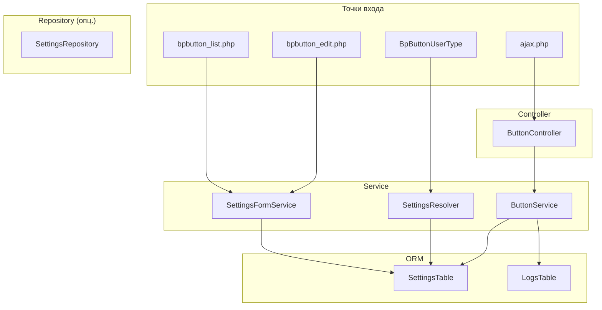

# Архитектурная схема: слои и потоки данных

**Дата создания:** 2026-03-16  
**Связь:** TASK-REF-005, backend_d7.md

---

## 1. Диаграмма слоёв

---

## 2. Потоки данных

### 2.1. Клик по кнопке в CRM

1. **JS** (button.js, button.api.js) — читает `data-*` атрибуты, вызывает AJAX
2. **ajax.php** — маршрутизация в `ButtonController::getConfigAction`
3. **ButtonController** — проверка сессии, прав CRM, вызов `ButtonService`
4. **ButtonService** — `getSidePanelConfig()`: чтение настроек из `SettingsTable`, проверка активности
5. **Ответ** — JSON `{ success: true, data: { url, title, width, context } }` или `{ success: false, error: { code, message } }`
6. **JS** (button.sidepanel.js) — открытие `BX.SidePanel.Instance` с полученным URL

### 2.2. Рендеринг кнопки в карточке CRM

1. **BpButtonUserType::getPublicViewHTML** — тонкая обёртка, делегирует в `ButtonHtmlRenderer`
2. **ButtonHtmlRenderer** — формирует HTML кнопки (классы, атрибуты)
3. **SettingsResolver** — получает `BUTTON_TEXT`, `BUTTON_SIZE` из `SettingsTable` (с кешированием)
4. **Результат** — HTML с `data-entity-id`, `data-element-id`, `data-field-id`, `data-user-id`

### 2.3. Сохранение формы админки

1. **bpbutton_edit.php** — приём POST, валидация
2. **SettingsFormService** — `save()`, `toggleActive()`: работа с `SettingsTable`
3. **SettingsTable** — INSERT/UPDATE записей

### 2.4. Inline toggle активности в списке

1. **bpbutton_list_ajax.php** — приём AJAX-запроса
2. **SettingsFormService::toggleActive** — переключение `ACTIVE` в `SettingsTable`

---

## 3. Зависимости между компонентами

| Компонент | Зависит от |
|-----------|------------|
| ButtonController | ButtonService, CrmAccessChecker, SecurityHelper |
| ButtonService | SettingsTable, LogsTable |
| SettingsResolver | SettingsTable |
| SettingsFormService | SettingsTable |
| ButtonHtmlRenderer | SettingsResolver |
| BpButtonUserType | ButtonHtmlRenderer |
| CrmAccessChecker | CRM API (crm.entity.get) |

---

## 4. Связь с другими документами

- `backend_d7.md` — детальное описание слоёв
- `../api/response_format.md` — формат ответов API
- `../module_structure/filesystem.md` — файловая структура
