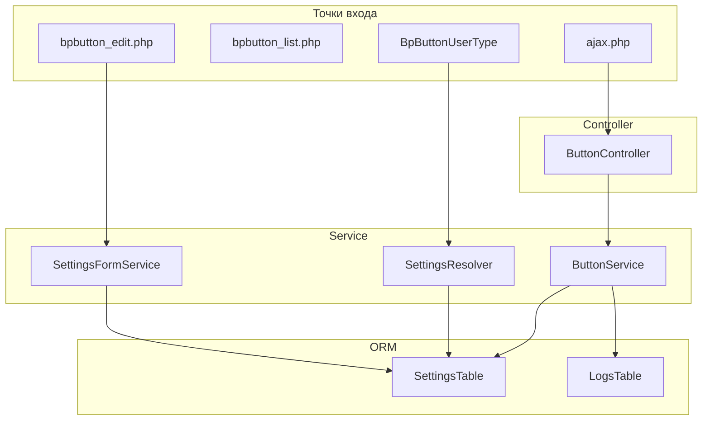

# TASK-REF-005: Структура модуля и документация

**Дата создания:** 2026-03-16 (UTC+3, Брест)  
**Статус:** Новая  
**Приоритет:** Высокий  
**Исполнитель:** Bitrix24 Программист / Технический писатель  
**Связь с планом:** REFACTOR-PLAN-001-five-stages.md, Этап 5

---

## Описание

Этап 5 — финальный. После выполнения этапов 1–4 модуль имеет обновлённую структуру: разделённые UserField, Admin, JS-модули, усиленный сервисный слой. Задача этапа 5 — зафиксировать итоговую структуру в документации, создать README модуля, обновить архитектурные документы и подготовить чек-лист для новых разработчиков.

**Цель задачи:** Модуль документирован, структура прозрачна, упрощён онбординг.

---

## Контекст

### Предполагаемое состояние после этапов 1–4

| Этап | Добавлено/изменено |
|------|---------------------|
| 1 | ButtonHtmlRenderer, SettingsResolver; BpButtonUserType упрощён |
| 2 | bpbutton_edit.php, SettingsFormService; bpbutton_list упрощён |
| 3 | button.state.js, button.utils.js, button.api.js, button.sidepanel.js; button.js упрощён |
| 4 | SettingsRepository (опц.), CrmAccessChecker (опц.); ButtonController упрощён; единый формат API |

### Существующая документация

- `docs_antonov/first_module/module_structure/filesystem.md` — структура модуля (устареет)
- `docs_antonov/first_module/architecture/backend_d7.md` — архитектура backend (устареет)
- `docs_antonov/first_module/overview.md` — обзор модуля
- `docs_antonov/first_module/local_button.md` — master-спецификация
- `docs_antonov/README.md` — общий обзор документации

---

## Модули и компоненты

### Новые документы

| Путь | Назначение |
|------|------------|
| `local/modules/my.bpbutton/README.md` | README модуля: назначение, установка, основные точки входа, быстрый старт. |
| `docs_antonov/first_module/architecture/layers-diagram.md` | Архитектурная схема: слои, потоки данных, диаграмма. |
| `docs_antonov/first_module/onboarding-checklist.md` | Чек-лист для новых разработчиков. |

### Изменяемые документы

| Путь | Изменения |
|------|-----------|
| `docs_antonov/first_module/module_structure/filesystem.md` | Обновить дерево файлов под итоговую структуру (ButtonHtmlRenderer, SettingsResolver, SettingsFormService, bpbutton_edit, JS-модули, Repository, CrmAccessChecker). |
| `docs_antonov/first_module/architecture/backend_d7.md` | Обновить описание слоёв: Controller → Service → Repository → ORM. Добавить SettingsResolver, SettingsFormService, ButtonHtmlRenderer. |
| `docs_antonov/first_module/overview.md` | Обновить карту артефактов, добавить ссылки на новые документы. |
| `docs_antonov/first_module/api/response_format.md` | Создать или обновить — единый формат ответов API (из TASK-REF-004). |

---

## Зависимости

### От каких модулей/задач зависит

- **TASK-REF-001** — выполнена (ButtonHtmlRenderer, SettingsResolver)
- **TASK-REF-002** — выполнена (bpbutton_edit, SettingsFormService)
- **TASK-REF-003** — выполнена (JS-модули)
- **TASK-REF-004** — выполнена (сервисный слой, формат API)

### Какие задачи зависят от этой

- Все последующие задачи по модулю — используют обновлённую документацию как источник истины.

---

## Детальная спецификация документов

### 1. README модуля (`local/modules/my.bpbutton/README.md`)

**Назначение:** Первый документ для разработчика, открывающего модуль. Краткий обзор без погружения в детали.

**Структура:**

```markdown
# Модуль my.bpbutton — Кнопка бизнес-процесса

## Назначение
Краткое описание (2–3 предложения): пользовательский тип поля bp_button_field для CRM.

## Установка
- Требования: PHP 8.x, Bitrix24 коробка
- Шаги: Marketplace или ручная установка в /local/modules/
- После установки: создать поле типа bp_button_field, настроить в админке

## Основные точки входа
- UserField: BpButtonUserType, ButtonHtmlRenderer
- API: /bitrix/services/my.bpbutton/button/ajax.php → ButtonController::getConfigAction
- Админка: my_bpbutton_bpbutton_list.php (список), my_bpbutton_bpbutton_edit.php (форма)
- JS: Extension my_bpbutton.button (button.js + модули)

## Структура модуля (кратко)
lib/
├── UserField/     — BpButtonUserType, ButtonHtmlRenderer
├── Service/       — ButtonService, SettingsResolver, SettingsFormService
├── Controller/    — ButtonController
├── Repository/    — SettingsRepository (опц.)
├── Helper/        — SecurityHelper, CrmAccessChecker (опц.)
└── Internals/     — SettingsTable, LogsTable

## Документация
Полная документация: docs_antonov/first_module/
```

**Объём:** ~80–120 строк.

---

### 2. Архитектурная схема (`layers-diagram.md`)

**Назначение:** Визуализация слоёв и потоков данных.

**Содержание:**

1. **Диаграмма слоёв (текстовая или Mermaid):**
   - Точки входа (ajax.php, admin pages, UserField)
   - Controller
   - Service (ButtonService, SettingsResolver, SettingsFormService)
   - Repository (опционально)
   - ORM (SettingsTable, LogsTable)

2. **Потоки данных:**
   - Клик по кнопке CRM: JS → ajax.php → ButtonController → ButtonService → SettingsTable → JSON
   - Рендеринг кнопки: BpButtonUserType → ButtonHtmlRenderer → SettingsResolver → SettingsTable → HTML
   - Сохранение формы админки: bpbutton_edit.php → SettingsFormService → SettingsTable

3. **Зависимости между компонентами:**
   - Кто кого вызывает
   - Какие классы от каких зависят

**Пример Mermaid-диаграммы:**



---

### 3. Обновление filesystem.md

**Изменения в дереве файлов:**

Добавить после этапов 1–4:

```text
lib/
├── UserField/
│   ├── BpButtonUserType.php      # Тонкая обёртка
│   └── ButtonHtmlRenderer.php   # Генерация HTML кнопки
├── Service/
│   ├── ButtonService.php
│   ├── SettingsResolver.php     # Настройки отображения (BUTTON_TEXT, BUTTON_SIZE)
│   └── SettingsFormService.php # Валидация и сохранение формы админки
├── Repository/
│   └── SettingsRepository.php   # (опц.) Централизованный доступ к SettingsTable
├── Helper/
│   ├── SecurityHelper.php
│   └── CrmAccessChecker.php    # (опц.) Проверка прав CRM
...
admin/
├── bpbutton_list.php            # Только список
├── bpbutton_edit.php            # Форма редактирования
├── bpbutton_list_ajax.php       # AJAX toggle_active
...
install/
├── admin/
│   ├── my_bpbutton_bpbutton_list.php
│   └── my_bpbutton_bpbutton_edit.php  # Новый
├── js/my.bpbutton/
│   ├── button.state.js
│   ├── button.utils.js
│   ├── button.api.js
│   ├── button.sidepanel.js
│   ├── button.js
│   ├── admin.list.js
│   └── entity-editor.js
...
```

Обновить описание каждого файла/директории.

---

### 4. Обновление backend_d7.md

**Изменения:**

1. **Слой данных (ORM):** Без изменений. SettingsTable, LogsTable.

2. **Сервисный слой:** Добавить:
   - **SettingsResolver** — получение BUTTON_TEXT, BUTTON_SIZE для UserField (рендеринг), с кешированием.
   - **SettingsFormService** — валидация и сохранение формы админки, toggleActive.
   - **ButtonService** — getSidePanelConfig, logClick (без изменений).

3. **Repository (опционально):** SettingsRepository — централизованный доступ к SettingsTable для чтения.

4. **UserField:** BpButtonUserType делегирует в ButtonHtmlRenderer. ButtonHtmlRenderer использует SettingsResolver для получения настроек отображения.

5. **Controller:** ButtonController — только маршрутизация, проверки, вызов ButtonService. Без бизнес-логики.

6. **Схема:** Обновить раздел «Связь backend с frontend» с учётом ButtonHtmlRenderer.

---

### 5. Чек-лист для новых разработчиков (`onboarding-checklist.md`)

**Назначение:** Пошаговый гайд для онбординга.

**Структура:**

```markdown
# Чек-лист онбординга: модуль my.bpbutton

## 1. Окружение
- [ ] Установлена коробочная версия Bitrix24
- [ ] Модуль my.bpbutton установлен в /local/modules/
- [ ] Доступ к админке (права на модуль)

## 2. Понимание структуры
- [ ] Прочитан README модуля (local/modules/my.bpbutton/README.md)
- [ ] Изучена документация docs_antonov/first_module/
- [ ] Просмотрена архитектурная схема (layers-diagram.md)

## 3. Ключевые файлы
- [ ] BpButtonUserType — описание типа поля
- [ ] ButtonHtmlRenderer — рендеринг кнопки
- [ ] ButtonService — конфигурация SidePanel
- [ ] ButtonController — AJAX API
- [ ] SettingsFormService — форма админки

## 4. Первый запуск
- [ ] Создан тестовый лид с полем bp_button_field
- [ ] Настроена кнопка в админке (URL, заголовок)
- [ ] Клик по кнопке открывает SidePanel

## 5. Разработка
- [ ] Проверены namespaces (My\BpButton\*)
- [ ] Проверены пути к файлам (install/...)
- [ ] При необходимости — создан TASK-файл по шаблону
```

---

### 6. Формат ответов API (`api/response_format.md`)

**Назначение:** Единый формат для всех API-ответов модуля (из TASK-REF-004).

**Содержание:**
- Структура успеха: `{ success: true, data: {...} }`
- Структура ошибки: `{ success: false, error: { code, message } }`
- Коды ошибок: INVALID_SESSION, ACCESS_DENIED, SETTINGS_NOT_FOUND, BUTTON_INACTIVE, INTERNAL_ERROR
- Точки входа: ajax.php, ButtonController

---

## Ступенчатые подзадачи

### Подзадача 1: Создать README модуля

1.1. Создать `local/modules/my.bpbutton/README.md`  
1.2. Реализовать разделы: Назначение, Установка, Точки входа, Структура, Документация  
1.3. Проверить актуальность путей и имён файлов

### Подзадача 2: Создать архитектурную схему

2.1. Создать `docs_antonov/first_module/architecture/layers-diagram.md`  
2.2. Добавить диаграмму слоёв (Mermaid или текстовая)  
2.3. Описать потоки данных для каждого сценария  
2.4. Указать зависимости между компонентами

### Подзадача 3: Обновить filesystem.md

3.1. Открыть `docs_antonov/first_module/module_structure/filesystem.md`  
3.2. Обновить дерево файлов под итоговую структуру (ButtonHtmlRenderer, SettingsResolver, SettingsFormService, bpbutton_edit, JS-модули)  
3.3. Добавить опциональные компоненты (Repository, CrmAccessChecker)  
3.4. Обновить описание назначения ключевых директорий

### Подзадача 4: Обновить backend_d7.md

4.1. Открыть `docs_antonov/first_module/architecture/backend_d7.md`  
4.2. Добавить описание SettingsResolver, SettingsFormService, ButtonHtmlRenderer  
4.3. Обновить раздел «Сервисный слой»  
4.4. Обновить раздел «User type» (делегирование в ButtonHtmlRenderer)  
4.5. Добавить раздел «Repository» (если создан)

### Подзадача 5: Создать onboarding-checklist.md

5.1. Создать `docs_antonov/first_module/onboarding-checklist.md`  
5.2. Реализовать чек-лист по разделам  
5.3. Добавить ссылки на ключевые документы

### Подзадача 6: Создать/обновить response_format.md

6.1. Создать `docs_antonov/first_module/api/response_format.md` (если не существует)  
6.2. Описать единый формат ответов API  
6.3. Указать коды ошибок и их назначение

### Подзадача 7: Обновить overview.md

7.1. Открыть `docs_antonov/first_module/overview.md`  
7.2. Добавить в карту артефактов: layers-diagram.md, onboarding-checklist.md, response_format.md  
7.3. Обновить ссылки на структуру документации

### Подзадача 8: Проверка namespaces и путей

8.1. Составить таблицу классов и их путей  
8.2. Проверить соответствие namespaces и файловой структуры  
8.3. Проверить автозагрузку в install/index.php  
8.4. Зафиксировать расхождения (если есть) в документе

---

## Технические требования

- Документы в формате Markdown  
- Все пути — относительные от корня проекта или от docs_antonov  
- Диаграммы — Mermaid (если поддерживается) или ASCII-арт  
- Ссылки между документами — корректные, без битых

---

## Таблица namespaces и путей (после рефакторинга)

| Класс | Namespace | Путь к файлу |
|-------|-----------|--------------|
| BpButtonUserType | My\BpButton\UserField | lib/UserField/BpButtonUserType.php |
| ButtonHtmlRenderer | My\BpButton\UserField | lib/UserField/ButtonHtmlRenderer.php |
| ButtonService | My\BpButton\Service | lib/Service/ButtonService.php |
| SettingsResolver | My\BpButton\Service | lib/Service/SettingsResolver.php |
| SettingsFormService | My\BpButton\Service | lib/Service/SettingsFormService.php |
| ButtonController | My\BpButton\Controller | lib/Controller/ButtonController.php |
| EventHandler | My\BpButton | lib/EventHandler.php |
| SettingsTable | My\BpButton\Internals | lib/Internals/SettingsTable.php |
| LogsTable | My\BpButton\Internals | lib/Internals/LogsTable.php |
| SecurityHelper | My\BpButton\Helper | lib/Helper/SecurityHelper.php |
| SettingsRepository | My\BpButton\Repository | lib/Repository/SettingsRepository.php (опц.) |
| CrmAccessChecker | My\BpButton\Helper | lib/Helper/CrmAccessChecker.php (опц.) |

---

## Критерии приёмки

- [ ] Создан README модуля в корне модуля
- [ ] Создана архитектурная схема (layers-diagram.md)
- [ ] Обновлены filesystem.md и backend_d7.md
- [ ] Создан чек-лист онбординга
- [ ] Создан/обновлён документ формата API (response_format.md)
- [ ] Обновлён overview.md
- [ ] Проверены namespaces и пути
- [ ] Все ссылки между документами рабочие
- [ ] Новый разработчик может по документации понять структуру и начать работу

---

## Примеры

### README — раздел «Точки входа»

```markdown
## Основные точки входа

| Сценарий | Точка входа | Компонент |
|----------|-------------|-----------|
| Рендеринг кнопки в CRM | BpButtonUserType::getPublicViewHTML | ButtonHtmlRenderer |
| Клик по кнопке (API) | /bitrix/services/my.bpbutton/button/ajax.php | ButtonController::getConfigAction |
| Список настроек | my_bpbutton_bpbutton_list.php | bpbutton_list.php |
| Форма редактирования | my_bpbutton_bpbutton_edit.php | bpbutton_edit.php |
| Inline toggle активности | bpbutton_list_ajax.php | SettingsFormService::toggleActive |
```

### Карта артефактов (обновлённая, фрагмент)

```text
first_module/
├── overview.md
├── architecture/
│   ├── backend_d7.md
│   ├── data_model.md
│   ├── layers-diagram.md      # NEW
│   ...
├── api/
│   ├── ajax_controller.md
│   ├── response_format.md    # NEW or UPDATED
│   ...
├── onboarding-checklist.md   # NEW
...
```

---

## Тестирование

### Проверка документации

1. Новый разработчик (или ревьюер) проходит по onboarding-checklist.md  
2. Все ссылки в документах открываются  
3. Описание структуры соответствует фактическим файлам модуля  
4. README даёт достаточно информации для быстрого старта

---

## История правок

- 2026-03-16: Создан документ задачи TASK-REF-005 на основе REFACTOR-PLAN-001.
